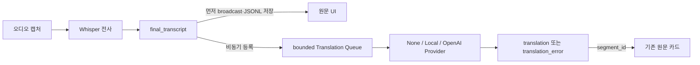

# Meeting Live Translator Phase 2 완료 보고서

- 완료일: 2026-07-11 (Asia/Seoul)
- 구현 범위: Phase 2의 확정 원문 일본어·영어 → 한국어 비동기 번역
- 기준 문서: 상위 `PROJECT_SPEC.md`와 Phase 2 구현 요청
- 제외 범위: 요약, Action Item·결정·질문 추출, 세션 내보내기 재설계, 화자 분리, 동시 시스템·마이크, 녹음, React/Vite, 데스크톱 패키징 및 배포

## 1. Phase 1 기준선 검사 결과

**PASS**

Phase 2 변경 전 기준선은 다음과 같았다.

| 항목 | 결과 |
|---|---|
| Python | 3.11.9, 64-bit |
| 기존 자동 테스트 | `53 passed in 0.69s` |
| `compileall` | PASS |
| Phase 1 실제 final 표시 지연 | 2.820~3.153초, 5회 모두 목표 2~4초 범위 |
| Git | 이 작업 폴더는 Git 저장소가 아니었음 |

기존 파일과 사용자 런타임 산출물은 삭제하거나 초기화하지 않았다.

## 2. 기존 테스트 결과

**PASS**

최종 전체 회귀 실행에서 Phase 1 테스트를 포함한 `93 passed, 2 skipped`를 확인했다. Phase 1 테스트 파일을 제거하거나 완화하지 않았고, 두 SKIP은 명시적 실사용 조건이 없는 OpenAI/로컬 번역 테스트뿐이다.

## 3. 번역 아키텍처

**PASS**



- 오디오 callback과 전사 worker에서는 번역을 실행하지 않는다.
- `final_transcript`를 먼저 WebSocket으로 전달하고 저장한 다음 번역 큐에 등록한다.
- partial은 번역 요청이나 외부 API 입력으로 사용하지 않는다.
- 큐 크기 100, 동시 작업 2, timeout 20초, 최대 재시도 2회가 기본이며 모두 설정 가능하다.
- segment별 상태·중복·재시도·취소를 추적한다.
- Provider 변경 시 이전 Provider의 queued/active 작업을 취소하고 안전한 오류 이벤트를 보낸 후 close한다.
- 앱 종료 순서는 캡처/전사 → 번역 manager → WebSocket이며, worker와 active call을 정리한다.
- 직전 문맥은 기본 3개 final로 제한하고, `unknown`은 기본적으로 번역하지 않는다.

## 4. 생성한 파일 목록

**PASS**

- `backend/app/translation/__init__.py`
- `backend/app/translation/base.py`
- `backend/app/translation/exceptions.py`
- `backend/app/translation/glossary.py`
- `backend/app/translation/local_provider.py`
- `backend/app/translation/manager.py`
- `backend/app/translation/models.py`
- `backend/app/translation/none_provider.py`
- `backend/app/translation/openai_provider.py`
- `backend/app/translation/queue.py`
- `backend/requirements-local-translation.txt`
- `config/translation_glossary.example.json`
- `setup_local_translation.bat`
- `scripts/benchmark_phase2_translation.py`
- `docs/phase2_local_translation_evaluation.md`
- `docs/phase2_report.md`
- `tests/test_translation_models_providers.py`
- `tests/test_translation_manager.py`
- `tests/test_phase2_config_security.py`
- `tests/test_phase2_integration.py`
- `tests/test_live_translation.py`
- `tests/phase2_manual_test_checklist.md`

## 5. 수정한 파일 목록

**PASS**

- `backend/app/config/settings.py`
- `backend/app/api/schemas.py`
- `backend/app/services.py`
- `backend/app/capture/controller.py`
- `backend/app/main.py`
- `backend/app/sessions/repository.py`
- `backend/app/websocket/manager.py`
- `backend/requirements.txt`
- `frontend/static/index.html`
- `frontend/static/app.js`
- `frontend/static/style.css`
- `tests/test_sessions.py`
- `tests/test_websocket_manager.py`
- `.env.example`
- `.gitignore`
- `AGENTS.md`
- `README_KO.md`
- `setup.bat`

`start_all.bat`, `stop_all.bat`, Phase 1 보고서와 Phase 1 요구사항 파일은 동작을 보존했다.

## 6. 구현한 Provider

**PASS**

| Provider | 외부 전송 | 동작 |
|---|---:|---|
| `none` | 아니오 | 기본값. 번역 비활성 상태만 기록하고 원문 흐름 유지 |
| `openai` | 예 | 공식 비동기 SDK/Responses API, 키·SDK 상태 감지, 안전한 오류 분류 |
| `local` | 아니오 | 명시적 로컬 경로만 사용, M2M100/CTranslate2 CPU int8 adapter, lazy load, 자동 다운로드 금지 |

공통 인터페이스는 health check, translate, close를 제공한다. 모든 결과는 `segment_id`, 원문/대상 언어, Provider, 모델, 상태, 지연을 가진다.

## 7. OpenAI 연동 방식

**PASS(구조·mock), SKIP(실제 유료 호출)**

- 공식 Python SDK `openai==2.45.0`의 `AsyncOpenAI.responses.create`를 사용한다.
- 기본 모델은 `gpt-5.4-mini`이며 `OPENAI_TRANSLATION_MODEL`로 변경할 수 있다.
- SDK 자체 재시도는 0으로 두고 manager의 bounded retry/timeout만 사용해 요청 증폭을 막는다.
- 입력은 현재 final과 제한된 직전 문맥, 공통 용어집뿐이다. 현재 발화만 번역하고 설명을 붙이지 않도록 지시한다.
- 숫자, 날짜, 시간, 통화, 버전, IP, port, 명령, 경로, 테이블·컬럼, 오류 코드와 고유 용어 보존을 지시한다.
- 응답은 `output_text`만 허용하며 빈 응답은 안전한 오류로 처리한다.
- API 키는 서버 환경 또는 `.env`에서만 읽고 프론트엔드에는 설정 여부 boolean만 반환한다.

구현 기준은 OpenAI의 [Responses API 텍스트 가이드](https://developers.openai.com/api/docs/guides/text), [공식 SDK 안내](https://developers.openai.com/api/docs/libraries), [모델 목록](https://developers.openai.com/api/docs/models)을 확인했다.

실제 호출은 `OPENAI_API_KEY`, `RUN_OPENAI_LIVE_TEST=1`, 명시적 `OPENAI_TRANSLATION_MODEL` 세 조건을 모두 요구한다. 현재는 모두 없어 **SKIP**, 과금 요청은 0건이다.

## 8. 로컬 번역 모델 평가 결과

**PASS(조사·구조), SKIP(설치·실제 번역)**

- 환경: Windows 11, Python 3.11.9, RAM 31.54GiB, 조사 시 가용 약 15.22GiB, NVIDIA/CUDA 없음, CTranslate2 4.8.1 CPU int8 가능.
- 조건부 1순위 PoC: MIT 라이선스 `facebook/m2m100_418M` → CTranslate2 CPU int8.
- 예상 변환본 0.5~0.8GiB, 추가 RAM 1~3GiB는 추정값이며 실측이 아니다.
- NLLB-200 distilled 600M은 비상업·연구/비프로덕션 제한 때문에 기본 후보에서 제외했다.
- mBART-50은 해당 checkpoint 라이선스 미확인과 크기 때문에 보류했다.
- OPUS-MT pivot은 일본어가 2단계가 되어 지연·오류 누적 때문에 기본 후보에서 제외했다.
- 모델은 캐시에 없고 Transformers/SentencePiece도 기본 환경에 설치하지 않았다.
- optional setup은 tokenizer 런타임 의존성만 설치하며 모델이나 PyTorch를 자동 다운로드하지 않는다.
- 로컬 모델 폴더는 `model.bin`과 SentencePiece 자산이 함께 있어야 설치됨으로 판정한다.

세부 라이선스, 크기, RAM, 변환·PoC 절차는 `docs/phase2_local_translation_evaluation.md`에 기록했다.

## 9. 구현한 UI 기능

**MANUAL PASS**

- `사용 안 함 / 로컬 모델 / OpenAI API` 선택.
- Provider별 사용 가능 여부, 외부 API 여부, API 키 설정 여부, 로컬 모델 설치 여부, 번역 상태 표시.
- OpenAI 선택 시 final과 제한 문맥이 외부로 전송될 수 있다는 안내, 참가자 동의·회사 정책 확인 문구 표시.
- 키 값 입력/표시 필드는 없고 서버 설정 여부만 표시.
- 원문 카드에 pending, translating, success, error, disabled 상태와 Provider·지연·안전한 오류·재번역 버튼 표시.
- 늦거나 역순인 결과는 `segment_id` Map으로 원문 카드에만 연결하며 카드 순서를 바꾸지 않는다.
- 재번역 중 이전 성공 번역을 유지하고 새 성공 결과가 도착할 때 교체한다.
- partial에는 원문만 표시한다.
- 390×844 DOM 검증에서 가로 overflow 없음, 주요 컨트롤 존재, 콘솔 오류 0건.

## 10. WebSocket 이벤트 변경사항

**PASS**

| 이벤트 | 용도 | queue 정책 |
|---|---|---|
| `translation_pending` | 큐 등록 | lossy/coalescible |
| `translation_status` | translating/disabled/skipped | lossy/coalescible |
| `translation` | 성공 결과 | critical |
| `translation_error` | 안전한 오류 코드/문구 | critical |
| `translation_provider_status` | Provider 변경 상태 | 일반 이벤트 |

snapshot에는 공개 번역 설정과 queue 상태를 포함한다. API 키 값, raw exception, Authorization header는 포함하지 않는다.

## 11. JSONL 저장 변경사항

**PASS**

- Phase 1 final row 형식은 변경하지 않았다.
- 성공 번역은 같은 session JSONL에 별도 `type: translation` row로 append한다.
- `segment_id`, 언어, 번역문, Provider, 모델, 지연, 시각만 whitelist한다.
- API 키, raw 오류, 전체 SDK 요청/응답, partial은 저장하지 않는다.
- 번역이 캡처 stop 뒤 완료돼도 이미 알려진 session ID에는 안전하게 append할 수 있다.

## 12. 실행한 자동 테스트

**PASS**

요구된 38개 항목을 다음 파일에서 검증했다.

| 테스트 파일 | 주요 검증 |
|---|---|
| `test_translation_models_providers.py` | Provider 인터페이스, request/result 검증, none, OpenAI mock 성공·실패, 키 없음, 인증/rate/network/빈 응답, prompt·숫자·용어, local 설치 감지·glossary 복원 |
| `test_translation_manager.py` | final-only, partial skip, 중복 방지, 역순 segment 매칭, queue limit, worker·shutdown, timeout/retry/backoff, provider 변경, mixed/unknown |
| `test_phase2_integration.py` | 원문 먼저 broadcast, Provider 예외 후 전사 유지, 외부 오류 시 원문 이벤트 유지, pending/success/error, API 전환·사용 불가 Provider, WebSocket snapshot, JSONL |
| `test_phase2_config_security.py` | 안전한 기본값, env 우선순위, glossary 파일, `.env` ignore, API·로그·repr에서 키/raw 오류 비노출 |
| `test_sessions.py` | translation row whitelist와 기존 final 호환 |
| `test_websocket_manager.py` | 신규 이벤트의 bounded queue 우선순위 |
| `test_live_translation.py` | 실제 OpenAI/로컬 호출을 명시적 환경 조건으로만 허용 |
| 기존 Phase 1 테스트 | 장치, 오디오 처리, 캡처 controller, 전사, API, WebSocket, session 회귀 |

추가로 `compileall`, JS 구문 검사, `pip check`, strict 오디오 장치 검사, setup/start/stop, 비과금 20건 benchmark를 실행했다.

## 13. 자동 테스트 결과

**PASS, 조건부 실사용 2건 SKIP**

```text
pytest: 93 passed, 2 skipped
compileall: PASS
frontend app.js syntax: PASS
pip check: PASS
setup.bat: PASS
strict audio device check: PASS (output 11 / loopback 3 / microphone 8)
```

SKIP:

1. OpenAI live — 키, 실행 플래그, 명시적 모델 없음.
2. Local live — 모델 경로와 실행 플래그 없음.

## 14. 실행한 수동 테스트

실행 절차와 개별 20개 결과는 `tests/phase2_manual_test_checklist.md`에 기록했다.

실제로 수행한 항목:

- API 키와 `.env` 없이 `start_all.bat` 실행 및 health 확인.
- 브라우저 WebSocket 연결, Provider 상태와 보안 안내 확인.
- 시스템 loopback 캡처 시작/중지와 실제 final 저장 확인.
- 번역 OFF 상태 확인.
- 로컬 모델 미설치 표시와 disabled 적용 버튼 확인.
- OpenAI 키 미설정·외부 전송 경고·키 입력란 부재 확인.
- 390×844 반응형 DOM, 일반 화면 이미지, 콘솔 오류 확인.
- `stop_all.bat` 프로젝트 PID 종료 확인.

## 15. 수동 테스트 결과

| 분류 | 결과 |
|---|---:|
| 원래 요구된 20개 항목 | MANUAL PASS 3, SKIP 17 |
| 추가 UI·런타임 검증 | MANUAL PASS 5 |

원래 목록에서 MANUAL PASS:

- #6 API 키 없이 원문 전사.
- #11 번역 OFF.
- #16 로컬 모델 설치 상태 표시.

실제 번역 품질·오류·장시간 항목은 Provider 전제 조건이 없어 SKIP했다. 자동 mock/fake 결과를 수동 PASS로 바꾸지 않았다.

## 16. 원문 final 표시 지연

**PASS(Phase 1 기준), ENVIRONMENT DIFFERENCE(Phase 2 실사용 ON 비교)**

- 검증된 Phase 1 음성 종료→브라우저 final 5회: 2.863, 2.820, 3.153, 2.875, 2.940초.
- Phase 2 키 없는 실제 loopback 재실행은 final 2건을 정상 저장했고 inference 시간은 2.726초, 3.229초였다.
- 이번 재실행에서는 음성 종료→브라우저 표시 시각을 별도 계측하지 않았으므로 inference 시간을 final 표시 지연으로 과장하지 않는다.
- 코드·통합 테스트에서 final broadcast와 저장이 번역 submit보다 먼저 일어남을 확인했다.

## 17. 번역 처리 지연

**PASS(fake benchmark), SKIP(실제 Provider)**

20개 final, 50ms fake Provider, 동시성 2의 비과금 benchmark:

| 구간 | median | p95 | max |
|---|---:|---:|---:|
| final 생성→번역 등록(ON) | 0.023ms | 0.035ms | 0.050ms |
| final 생성→translation event | 314.889ms | 589.279ms | 589.309ms |

실제 OpenAI 네트워크 지연과 실제 로컬 모델 지연은 SKIP이다. 음성 종료→번역 표시 역시 실제 Provider가 없어 측정하지 않았다.

## 18. 번역 OFF와 ON 성능 비교

**PASS(등록 오버헤드 proxy), SKIP(실제 음성+Provider A/B)**

| 모드 | final→등록 median | p95 | 원문이 번역을 기다림 |
|---|---:|---:|---|
| OFF (`none`) | 0.030ms | 0.131ms | 아니오 |
| ON (50ms fake) | 0.023ms | 0.035ms | 아니오 |

측정 오차 범위에서 queue 등록 때문에 원문 path가 느려진 징후는 없었다. 다만 실제 OpenAI 또는 M2M100과 동일 음성으로 측정한 final 표시 ON/OFF A/B는 환경 전제 부족으로 SKIP이다.

## 19. API 키 미설정 테스트

**MANUAL PASS**

- `OPENAI_API_KEY`: 미설정.
- `.env`: 없음.
- 서버: 정상 시작, health 200, Phase 2/version 반환.
- UI: OpenAI `설정되지 않음/사용 불가`, 키 값 필드 없음.
- 원문: 시스템 loopback에서 final 2건 저장.
- 번역: 기본 `none`, 외부 호출 0건.
- 종료: 정상.

## 20. OpenAI 오류 fallback 테스트

**PASS(mock), SKIP(실제 OpenAI 오류)**

자동 테스트에서 키 없음, 인증 실패, rate limit, timeout, network, 5xx/provider unavailable, 빈 응답, raw unknown exception을 안전한 오류 코드로 정규화했다. retryable 오류만 설정 횟수만큼 재시도하며 원문 `final_transcript`는 이미 전달·저장되어 유지된다. raw SDK message와 test secret은 API/WebSocket/log에 나타나지 않았다.

잘못된 실제 키나 실제 네트워크 차단 요청은 외부 호출 조건이 없어 SKIP했다.

## 21. 알려진 버그

**PASS — 실행한 범위에서 재현되는 미해결 기능 버그 없음**

구현 중 발견한 다음 문제는 최종 테스트 전에 수정했다.

- final 카드 렌더링의 누락된 `segment_id` 바인딩.
- 재번역 실패/진행 중 기존 성공 번역이 사라지는 문제.
- tokenizer 설정 파일만 있는 불완전 로컬 폴더를 설치됨으로 판정할 수 있던 문제.
- 상대 glossary 경로 해석의 중복·가독성 문제.

모바일 full-page 자동화 이미지가 일부 잘리는 도구 현상이 있었으나 DOM 폭, 일반 viewport, 컨트롤 존재, 콘솔 결과에서는 앱 overflow를 재현하지 못했다.

## 22. 알려진 제한사항

- 실제 OpenAI 번역 품질·비용·p50/p95는 검증하지 않았다.
- 실제 M2M100 설치·변환·품질·지연·peak RAM과 faster-whisper 동시 성능은 검증하지 않았다.
- 현재 CPU에는 NVIDIA/CUDA가 없어 전사와 로컬 번역이 동시에 CPU를 사용할 수 있다. 로컬 PoC에서는 concurrency 1과 thread 제한부터 검증해야 한다.
- `mixed`는 일본어 문자가 있으면 일본어 route, 아니면 영어 route의 보수적 규칙이다. `unknown`은 기본 skip이다.
- 번역 상태 record는 서버 프로세스 메모리에 유지되어 매우 긴 단일 실행에서는 segment 수만큼 증가한다.
- UI에서 바꾼 Provider는 현재 실행에만 적용되며 `.env`를 수정하지 않는다.
- 브라우저 새로고침 시 기존 session JSONL을 다시 읽어 카드에 복원하지 않는다.
- JSONL은 append-only 별도 translation row이며 기존 row를 제자리 갱신하지 않는다.
- 공식·법률·의료 번역 품질을 보증하지 않는다.

## 23. 보안 관련 확인사항

**PASS**

- 기본 bind와 브라우저 주소는 `127.0.0.1`.
- `.env`, 모델, runtime PID/log, 사용자 glossary, session JSONL은 Git ignore.
- API 키는 dataclass `repr`에서 제외되고 공개 설정에는 boolean만 반환.
- 프론트엔드에는 API 키 입력·표시 요소가 없음.
- raw Provider exception, 요청/응답, Authorization header, 로컬 파일 경로를 공개 오류나 log에 복사하지 않음.
- OpenAI에는 partial이 아니라 final 현재 발화와 제한 문맥만 전송.
- 외부 전송·참가자 동의·회사 정책 경고를 UI와 README에 표시.
- 앱은 오디오 녹음 파일을 저장하지 않으며 기존처럼 final 원문과 선택적 성공 번역만 로컬 JSONL에 저장.
- secret fixture를 사용한 API/WebSocket/log 비노출 테스트 PASS.

## 24. 사용자가 직접 확인해야 할 사항

1. 회사 회의 데이터를 OpenAI에 보낼 수 있는지 보안정책과 참가자 동의를 먼저 확인.
2. 승인된 별도 키·모델·실행 플래그로 OpenAI live opt-in 테스트와 실제 비용/지연 확인.
3. 잘못된 키, rate limit, 네트워크 차단, timeout 중 실제 원문 지속 여부 확인.
4. M2M100 고정 revision·해시·라이선스 승인 후 별도 build 환경에서 CT2 int8 변환.
5. 실제 ja→ko/en→ko, mixed IT 용어, 숫자·날짜·시간·고유명사 품질 검토.
6. 번역 ON/OFF 동일 음성으로 음성 종료→final, 등록→완료, 음성 종료→번역 표시 A/B 측정.
7. 30~60분 회의에서 CPU, 온도, RAM, queue, 누락과 지연 확인.
8. 실제 Zoom, 마이크, Bluetooth/헤드셋 전환 환경 확인.
9. 실행 중 Provider 변경과 기존 queued/active 작업 취소 UI 확인.

## 25. Phase 3에서 진행할 내용

이번 작업에서는 **구현하지 않았다**. 다음 단계 후보만 기록한다.

- 회의 요약.
- Action Item, 결정사항, 질문사항, 담당자·기한 추출.
- Markdown 회의 보고서와 전체 세션 내보내기 설계.
- 필요한 경우 세션 단위 번역 재처리·검색 UX.

화자 분리, 동시 시스템·마이크 전사, 오디오 녹음, React/Vite/Tauri/Electron, always-on-top, Media Caption Mode, 서비스별/DRM 기능과 배포 역시 Phase 2 범위 밖이며 추가하지 않았다.

---

## 최종 콘솔 요약

```text
변경 파일: 번역 core/provider/queue/API/WS/JSONL/UI/config/docs/tests
구현 기능: none/local/openai Provider, final-only 비동기 번역, segment 매칭, 상태/재시도, 보안 UI
테스트 결과: 93 passed, 2 skipped; compileall/JS/pip/audio/setup/start-stop/browser PASS
OpenAI 실사용 테스트 여부: SKIP (키·실행 플래그·명시적 모델 없음, 과금 0건)
로컬 번역 실사용 테스트 여부: SKIP (모델·선택 의존성 없음)
측정된 번역 지연: fake 50ms Provider 20건, final→event median 314.889ms / p95 589.279ms
남은 문제: 실제 Provider 품질·지연·RAM·장시간 A/B 미검증
사용자 직접 확인: 정책 승인 후 실제 Provider·실회의·오류·장시간 테스트
```
